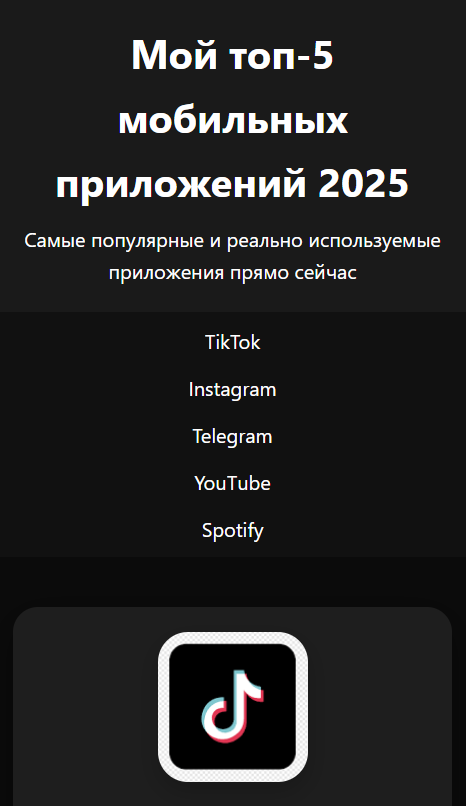
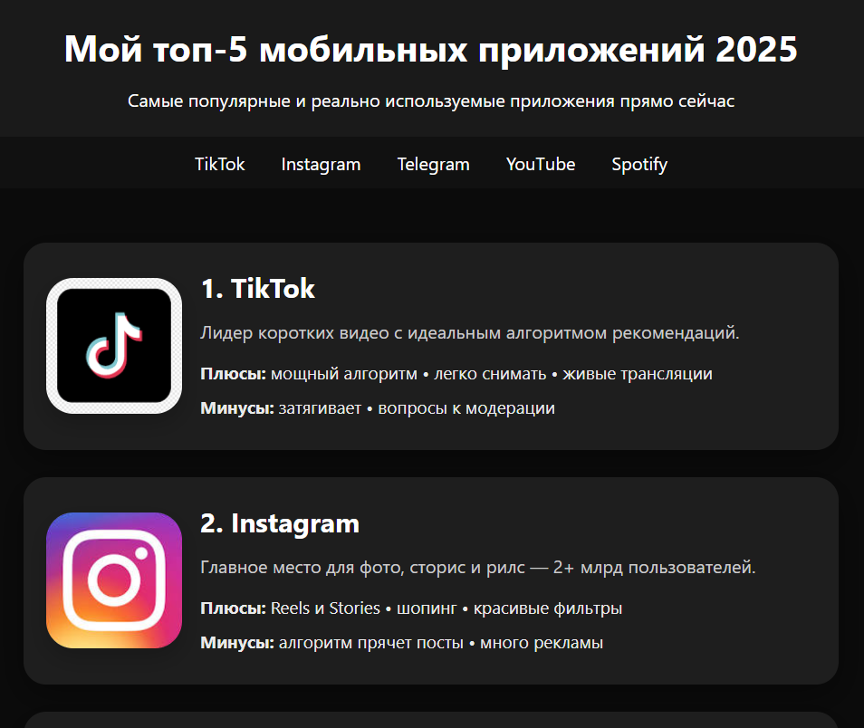
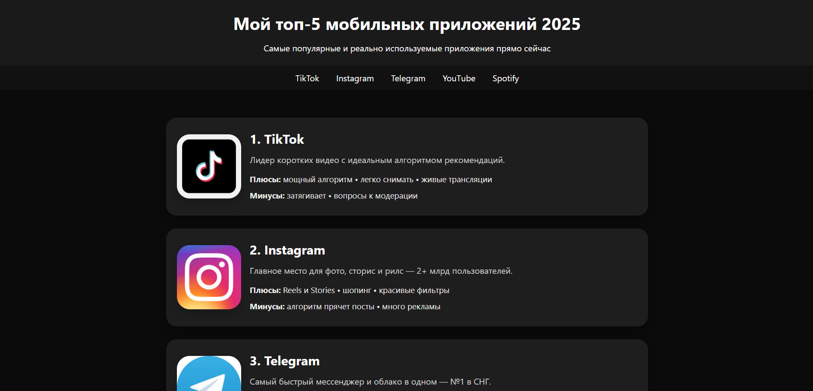
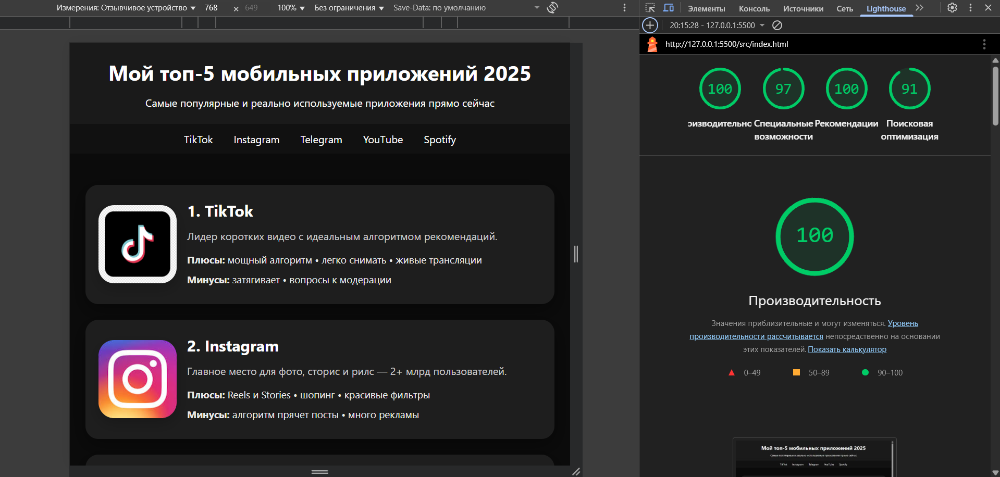

# Лабораторная работа №1

<p align="center">Министерство образования Республики Беларусь</p>
<p align="center">Учреждение образования</p>
<p align="center">"Брестский Государственный технический университет"</p>
<p align="center">Кафедра ИИТ</p>
<br><br><br><br><br><br>
<p align="center"><strong>Лабораторная работа №1</strong></p>
<p align="center"><strong>По дисциплине:</strong> "Веб-технологии"</p>
<p align="center"><strong>Тема:</strong> "HTML/CSS: семантика, адаптивность и доступность"</p>
<br><br><br><br><br><br>
<p align="right"><strong>Выполнил:</strong></p>
<p align="right">Студент 4 курса</p>
<p align="right">Группы АС-63</p>
<p align="right">Козловская А.Г.</p>
<p align="right"><strong>Проверил:</strong></p>
<p align="right">Несюк А.Н.</p>
<br><br><br><br><br>
<p align="center"><strong>Брест 2025</strong></p>

---

## Цель работы

Освоить основы семантической вёрстки HTML5, реализовать адаптивную структуру веб-страницы по принципу **mobile-first** и обеспечить её доступность в соответствии с современными стандартами.

---

### Вариант № 8

## Ход выполнения работы

### 1. Структура проекта

Проект организован согласно современным стандартам веб-разработки:

```text
task_01/
├── doc/
│   ├── README.md              # Отчёт о выполнении работы
│   └── screenshots/           # Скриншоты для отчёта
│       ├── desktop.png
│       ├── mobile.png
│       ├── tablet.png
│       ├── lighthouse.png
│
└── src/
    ├── index.html             # Основная HTML-страница
    ├── styles.css             # Стили с медиазапросами
    └── assets/
        └── img/               # Изображения приложений
            ├── tiktok.jpg
            ├── instagram.jpg
            ├── telegram.jpg
            ├── youtube.jpg
            └── spotify.jpg
```

**Описание файлов:**

- `index.html` — одностраничный сайт с топ-5 мобильных приложений 2025 года
- `styles.css` — стилизация по принципу mobile-first с медиазапросами для адаптивности
- `assets/img/` — локальные изображения логотипов приложений

### 2. Реализованные элементы

#### 2.1. Семантическая разметка HTML5

- Использованы структурные элементы: `<header>`, `<nav>`, `<main>`, `<article>`, `<footer>`
- Соблюдена правильная иерархия заголовков: `<h1>` для главного заголовка, `<h3>` для карточек приложений
- Каждое приложение оформлено как семантический `<article>` с уникальным `id` для навигации

#### 2.2. Адаптивная вёрстка (Mobile-first)

Реализованы **3 брейкпоинта** с использованием Flexbox:

- **Мобильные устройства (≤600px):**
  - Навигация расположена вертикально
  - Карточки приложений в одну колонку
  - Изображения центрированы

- **Планшеты (601–1024px):**
  - Навигация в одну строку
  - Карточки приложений: горизонтальный layout (иконка слева, контент справа)
  - Увеличенные отступы

- **Десктопы (>1025px):**
  - Контент ограничен максимальной шириной 1200px и центрирован
  - Оптимальная читаемость текста
  - Увеличенные отступы для комфортного просмотра

#### 2.3. Доступность (a11y)

**Навигация с клавиатуры:**

- Skip-link для быстрого перехода к основному контенту (`#main-content`)
- Видимые стили фокуса для всех интерактивных элементов (`:focus`, `:focus-visible`)
- Контур фокуса — 3px зелёный (#4CAF50) с отступом

**Семантические атрибуты:**

- Все изображения имеют описательные `alt` атрибуты
- Язык документа указан: `<html lang="ru">`
- Мета-теги `charset="UTF-8"` и `viewport` для корректного отображения

**Контрастность:**

- Основной текст: #111 на #FFF (светлая тема) — контраст **16.05:1** ✅
- Заголовки: белый текст на зелёном фоне (#4CAF50) — контраст **4.51:1** ✅
- Все текстовые элементы соответствуют WCAG AA (≥4.5:1)

#### 2.4. CSS Grid и Flexbox

**Flexbox используется для:**

- Навигации: выравнивание ссылок по центру с равномерными отступами
- Карточек приложений: вертикальный layout на мобильных, горизонтальный на планшетах/десктопах
- Центрирования контента и изображений

**Дополнительные техники:**

- CSS Custom Properties (переменные) для цветов: `--brand`, `--bg`, `--text`, `--muted`
- `object-fit: cover` для адаптивных изображений
- Плавные переходы (`transition`) для интерактивных элементов
- `box-shadow` для придания глубины карточкам

#### 2.5. Дополнительные улучшения (бонусы)

**Тёмная тема:**

- Автоматическое переключение на тёмную тему через `@media (prefers-color-scheme: dark)`
- Инвертированная цветовая схема: тёмный фон (#0b0b0b), светлый текст (#eaeaea)
- Корректировка контрастности для комфортного чтения

**Анимации:**

- Плавное поднятие карточек при наведении: `transform: translateY(-8px)`
- Увеличение тени для создания эффекта глубины
- Плавное появление skip-link при фокусе

### 3. Скриншоты выполненной лабораторной работы

#### Адаптивность на разных устройствах

- **Мобильная версия (≤600px):**  
  
*Вертикальная навигация, карточки в колонку, центрированные изображения*

- **Планшетная версия (601–1024px):**  
  
*Горизонтальная навигация, карточки с иконками слева*

- **Десктопная версия (>1024px):**  
  
*Полная ширина контента до 1200px, оптимальная читаемость*

---

## Проверка качества

### Lighthouse

Результаты проверки в Chrome DevTools:

**Accessibility и Best Practices:**  
  
*Оценка ≥90 баллов за корректные ARIA-атрибуты, контрастность и навигацию и соблюдение современных стандартов веб-разработки*

### Валидаторы

**HTML Validator ([validator.w3.org](https://validator.w3.org/)):**  
*Валидный HTML5 без критических ошибок*

**CSS Validator ([jigsaw.w3.org/css-validator](https://jigsaw.w3.org/css-validator/)):**  
*Валидный CSS3 с корректным синтаксисом*

---

## Таблица критериев

| Критерий                                                      | Баллы | Выполнено |
|---------------------------------------------------------------|-------|-----------|
| Семантика/структура (landmarks, заголовки)                    | 20    | ✅        |
| Адаптивная вёрстка (2+ брейкпоинта, Flex/Grid)              | 25    | ✅        |
| Доступность (alt/label, фокус, контраст, клавиатура)         | 20    | ✅        |
| Качество и валидность (Lighthouse ≥ 90, валидаторы)          | 15    | ✅        |
| Оформление кода/структура проекта                             | 10    | ✅        |
| Публикация и отчёт                                            | 10    | ✅        |
| **Итого**                                                     | **100** | **✅**  |

### Дополнительные бонусы (+ до 10 баллов)

| Бонус                                                         | Выполнено |
|---------------------------------------------------------------|-----------|
| Тёмная тема (`prefers-color-scheme`)                         | ✅        |
| Адаптивные изображения (`<picture>`, `srcset`)              | ❌        |
| Улучшения Web Vitals (CLS/LCP/INP) с пояснениями            | ❌        |
| Другие улучшения (анимации, плавные переходы)                | ✅        |

**Реализованные бонусы:**

- ✅ Автоматическая тёмная тема через медиазапрос
- ✅ Плавные анимации при наведении на карточки
- ✅ Skip-link для улучшенной навигации с клавиатуры

---

## Ссылка на публикацию

👉 **GitHub Pages:** <https://annkrq.github.io/WT-AC-2025/task_01/>

---

## Вывод

В ходе выполнения лабораторной работы был создан адаптивный одностраничный сайт "Топ-5 мобильных приложений 2025", полностью соответствующий современным стандартам веб-разработки.

**Что было сделано:**

- Реализована семантическая HTML5-разметка с использованием структурных элементов
- Создана адаптивная вёрстка по принципу mobile-first с тремя брейкпоинтами
- Обеспечена высокая доступность сайта (a11y) с поддержкой навигации с клавиатуры
- Добавлена автоматическая тёмная тема для комфортного просмотра
- Проект успешно прошёл проверку валидаторами W3C

**Освоенные навыки:**

- Семантическая вёрстка с правильной иерархией заголовков и landmarks
- Адаптивный дизайн с использованием Flexbox и медиазапросов
- Работа с CSS Custom Properties для управления цветовой схемой
- Обеспечение доступности веб-интерфейсов (WCAG AA)
- Оптимизация контрастности и читаемости текста

**Использованные инструменты:**

- HTML5, CSS3 (Flexbox, Custom Properties, Media Queries)
- Chrome DevTools (Device Mode, Lighthouse)
- W3C Validators (HTML, CSS)
- WebAIM Contrast Checker для проверки контрастности

Результат работы — полностью функциональный, доступный и адаптивный веб-сайт, готовый к публикации.
