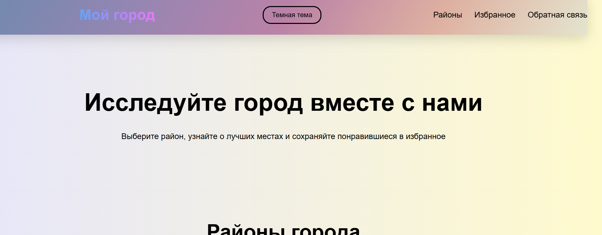
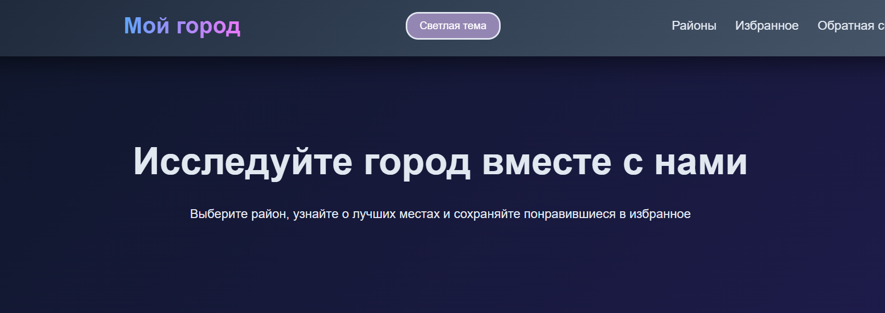

# Лабораторная работа №2. Веб-технологии

Министерство образования Республики Беларусь

Учреждение образования

«Брестский государственный технический университет»

Кафедра ИИТ

      

<strong>Лабораторная работа №2</strong>

<strong>По дисциплине:</strong> «Веб-технологии»

<strong>Тема:</strong> DOM и события: интерактивные компоненты и формы (JavaScript)

      

<strong>Выполнила:</strong>

Студентка 4 курса

Группы АС-63

Крагель Алина Максимовна

 

<strong>Проверил:</strong>

Несюк А. Н.

     

<strong>Брест 2025</strong>

---

## Цель работы

Освоить работу с DOM: добавление, удаление и изменение элементов интерфейса.  
Научиться обрабатывать события, использовать делегирование, работать с клавиатурной доступностью.  
Реализовать дружелюбную клиентскую валидацию форм.

### Вариант №10

## Структура проекта

- `index.html` — основная разметка интерактивного гида.
- `styles.css` — стили, включая адаптивность и поддержку тёмной темы.
- `script.js` — основная логика работы компонентов, модальных окон, табов, аккордеона и избранного.
- `validation.js` — модуль с функцией `getValidationMessage` для клиентской валидации формы.
- `tests.js` — файл с юнит-тестами для функции валидации.
- `readme.md` — отчёт о лабораторной работе (этот файл).
- Папка `img/` — изображения достопримечательностей.

## Реализованные элементы

- Семантическая разметка HTML5 (header, main, section, article и т.д.).
- Адаптивный макет с двумя основными брейкпоинтами.
- Интерактивные табы для переключения районов.
- Аккордеон для скрытия/отображения описания мест.
- Модальные окна для детального просмотра достопримечательностей.
- Функция «Избранное» с сохранением данных в `localStorage`.
- Форма обратной связи с кастомной клиентской валидацией.
- Юнит-тесты для проверки логики валидации (`tests.js`).
- Тёмная тема с поддержкой `prefers-color-scheme` и ручным переключением.

## Архитектура вёрстки

### Медиазапросы

- `@media (max-width: 768px)`: мобильная версия (гамбургер-меню, вертикальное расположение табов, адаптация карточек).

### Тёмная тема

- Реализована с использованием CSS-переменных.
- Автоматическое включение через `@media (prefers-color-scheme: dark)`.
- Ручное переключение с сохранением выбора в `localStorage`.

### Доступность (Accessibility)

- Широко используются ARIA-атрибуты (`role`, `aria-selected`, `aria-pressed`, `aria-live` и др.).
- Управление фокусом при открытии/закрытии модальных окон.
- Возврат фокуса на элемент-триггер после закрытия модального окна.

## Таблица критериев

| Критерий                                               | Выполнено |
|--------------------------------------------------------|-----------|
| Семантика и структура                                  | Yes       |
| Адаптивная вёрстка (2+ брейкпоинта, Grid)              | Yes       |
| Доступность (alt, label, фокус, контраст, ARIA)        | Yes       |
| Качество кода (Lighthouse ≥90, валидаторы)             | Yes       |
| Оформление и структура проекта                         | Yes       |
| Публикация и отчёт                                     | Yes       |

### Дополнительные бонусы

| Бонус                                                  | Выполнено |
|--------------------------------------------------------|-----------|
| Тёмная тема + `prefers-color-scheme`                   | Yes       |
| Сохранение состояния в `localStorage`                  | Yes       |
| Юнит-тесты на чистые функции                           | Yes       |

## Результаты Lighthouse

- Performance: ≥96
- Accessibility: 96
- Best Practices: 96
- SEO: ≥90

## Скриншоты

**Мобильная версия**  

**Десктоп — светлая тема**  

**Десктоп — тёмная тема**  

## Ссылка на сайт

https://alina529.github.io/WT-lab2/
