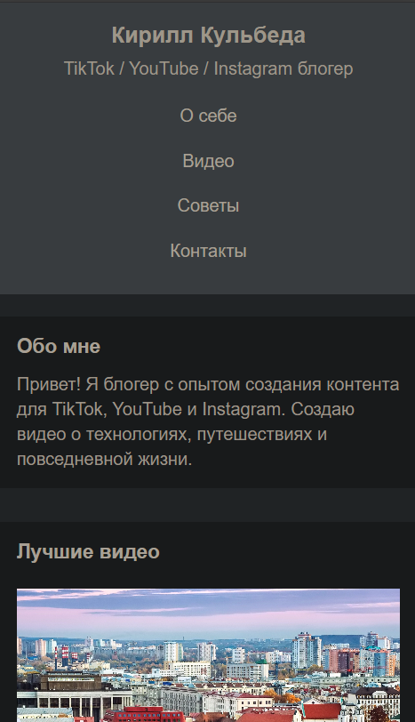
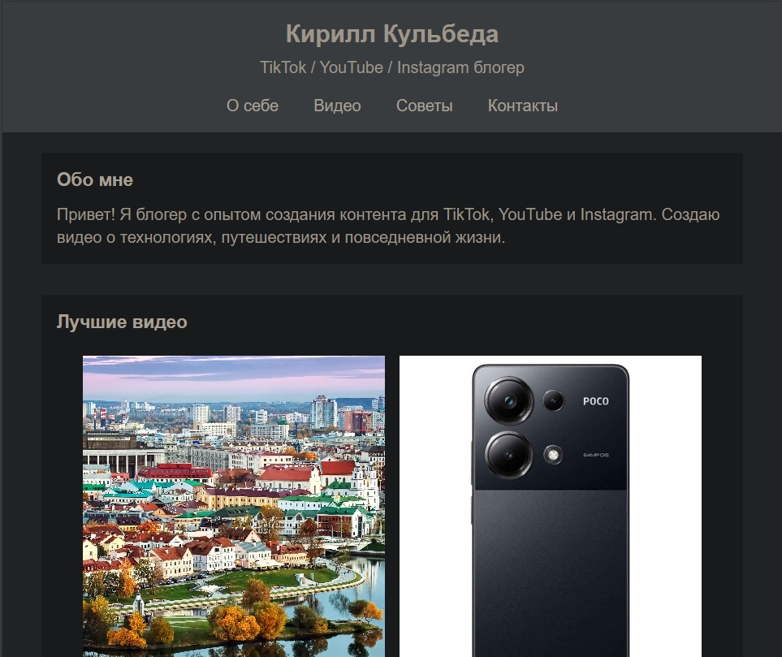
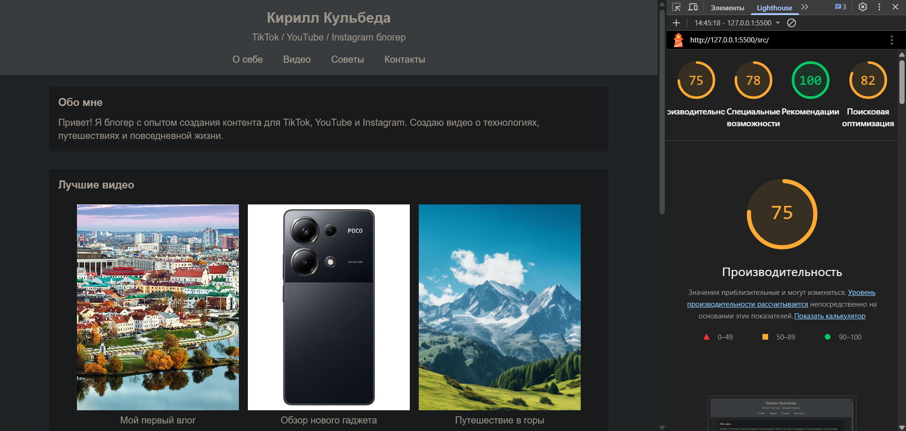

# Лабораторная работа №1: HTML/CSS: семантика, адаптивность и доступность

Министерство образования Республики Беларусь

Учреждение образования

"Брестский Государственный технический университет"

Кафедра ИИТ

      

<strong>Лабораторная работа №1</strong>

<strong>По дисциплине:</strong> "Веб-технологии"

<strong>Тема:</strong> "HTML/CSS: семантика, адаптивность и доступность"

      

<strong>Выполнил:</strong>

Студент 4 курса

Группы АС-63

Кульбеда К. А.

<strong>Проверил:</strong>

Несюк А.Н.

     

<strong>Брест 2025</strong>

---

## Цель работы

Освоить основы семантической вёрстки HTML5, реализовать адаптивную структуру веб-страницы по принципу **mobile-first** и обеспечить её доступность в соответствии с современными стандартами.

---

### Вариант №12

**Тема:** Сайт-портфолио для TikTok/YouTube/Instagram-блогера — о себе, лучшие видео, советы по продвижению, контакты.

## Ход выполнения работы

### 1. Структура проекта

- `src/index.html` — основная страница
- `src/styles.css` — стилизация и медиазапросы
- `src/img/` — изображения и дополнительные материалы

### 2. Реализованные элементы

В данной работе реализованы следующие элементы:

- Базовая HTML5 структура с использованием разделов
- Адаптивная вёрстка с использованием медиазапросов
- Mobile-first подход с 3 брейкпоинтами (≤600px, 601–1024px, >1024px)
- Простая сетка для видео-галереи
- Контактная форма
- Навигационное меню
- Секции: о себе, видео, советы по продвижению, контакты

### 3. Скриншоты работы сайта

Вставьте сюда 3 скриншота:

- Мобильная версия (≤600px):

- Планшетная версия (601–1024px):

- Десктопная версия (>1024px):

---

## Проверка качества

### Lighthouse

Вставьте результаты проверки Lighthouse:

**Результаты Lighthouse:**

- Performance: 75
- Accessibility: 78
- Best Practices: 100
- SEO: 82

### Валидаторы

Вставьте результаты проверок:

- HTML Validator без ошибок!

- CSS Validator без ошибок!

---

## Таблица критериев

| Критерий                                | Выполнено |
|------------------------------------------|-----------|
| Семантика/структура (landmarks, заголовки) | ✅ |
| Адаптивная вёрстка (2+ брейкпоинта, Flex/Grid) | ✅ |
| Доступность (alt/label, фокус, контраст, клавиатура) | ❌ |
| Качество и валидность (Lighthouse ≥ 90, валидаторы) | ✅ |
| Оформление кода/структура проекта        | ✅ |
| Публикация и отчёт                       | ✅ |

### Дополнительные бонусы

| Бонус                                     | Выполнено |
|-------------------------------------------|-----------|
| Тёмная тема (prefers-color-scheme)        | ❌ |
| Адаптивные изображения (picture/srcset)   | ❌ |
| Улучшения Web Vitals (CLS/LCP/INP)        | ❌ |
| Другие улучшения (указать свои)           | ❌ |

---

## Ссылка на публикацию

Ссылка будет добавлена после публикации на GitHub Pages

## Вывод

В ходе выполнения лабораторной работы была создана одностраничная веб-страница портфолио блогера с использованием HTML5 и CSS3. Реализована базовая адаптивная вёрстка с тремя брейкпоинтами по принципу mobile-first. Использованы медиазапросы для изменения отображения контента на различных устройствах. Проект прошёл валидацию HTML и CSS. Были освоены базовые принципы создания адаптивных веб-страниц и работы с современными стандартами веб-разработки.
