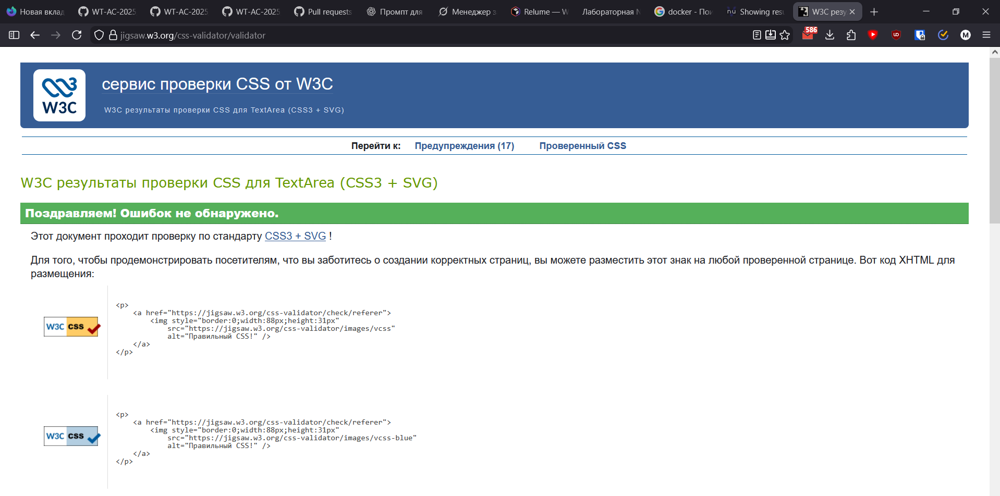
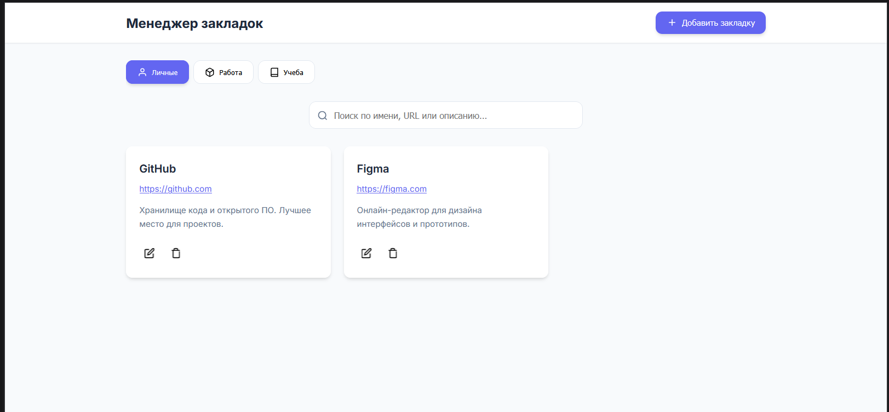
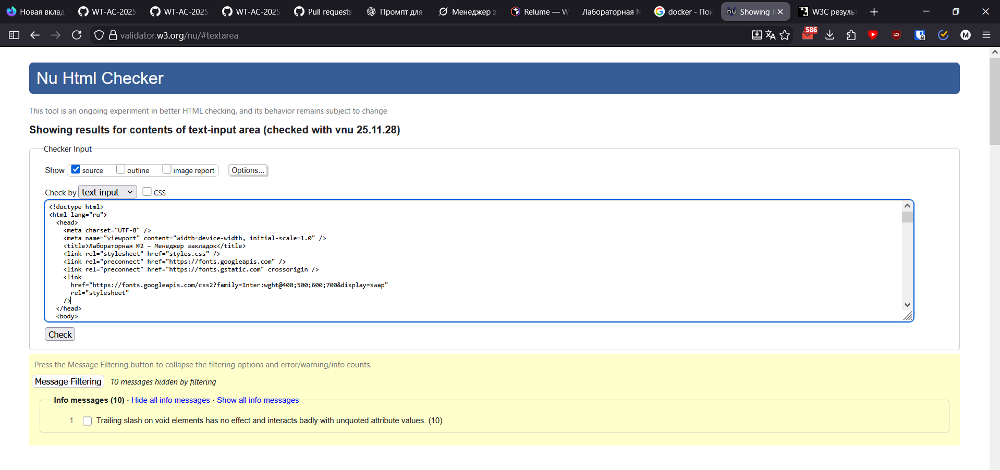
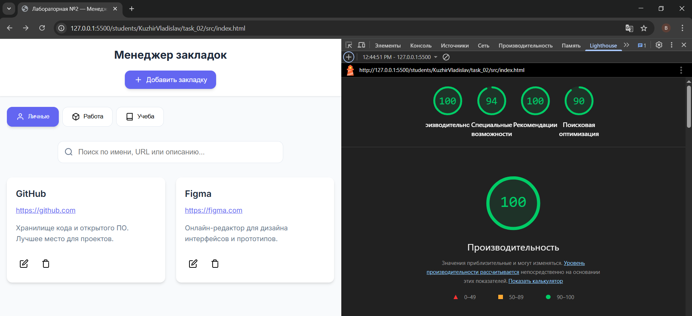
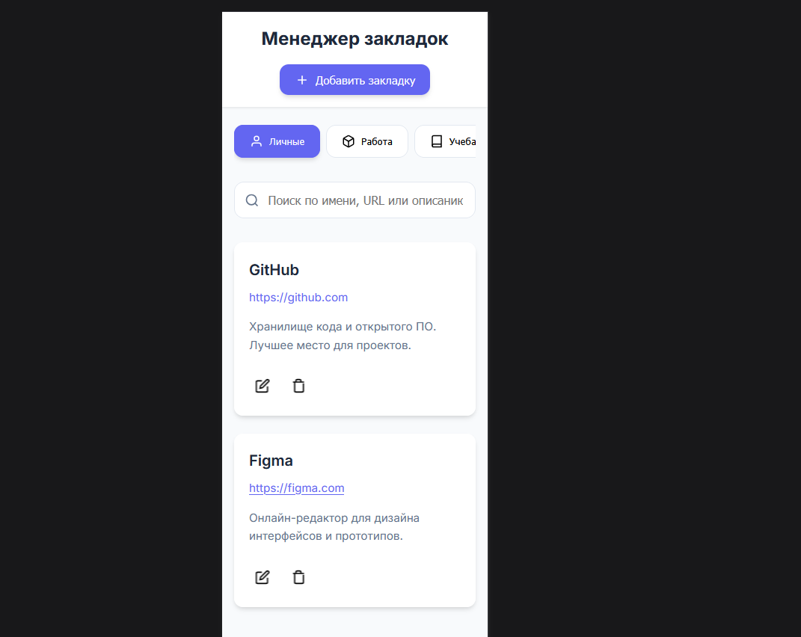
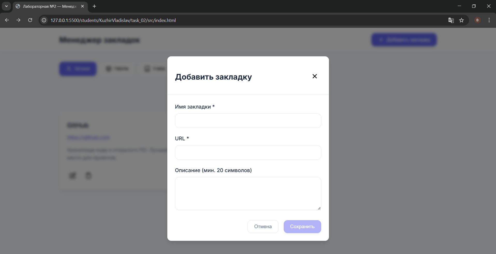
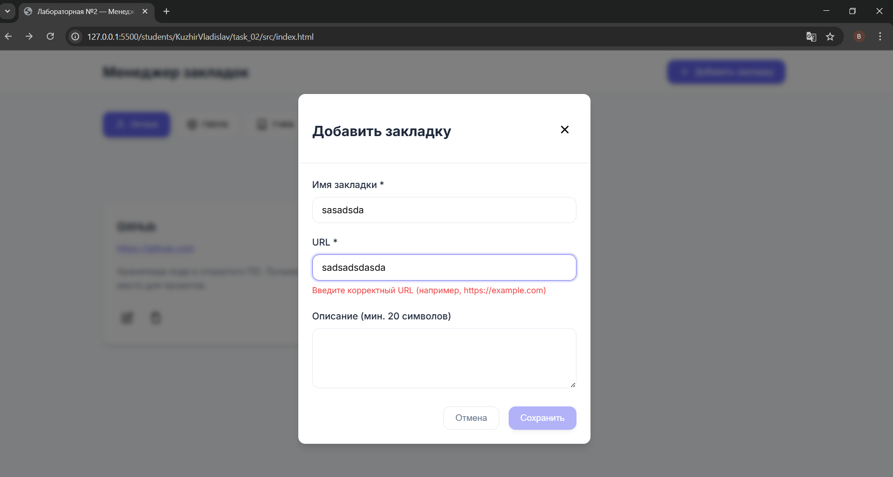
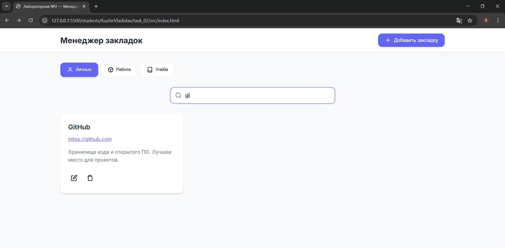
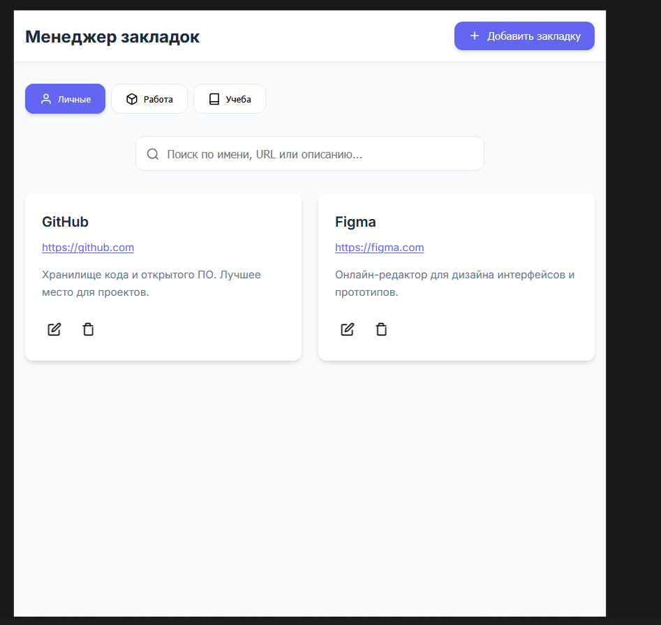
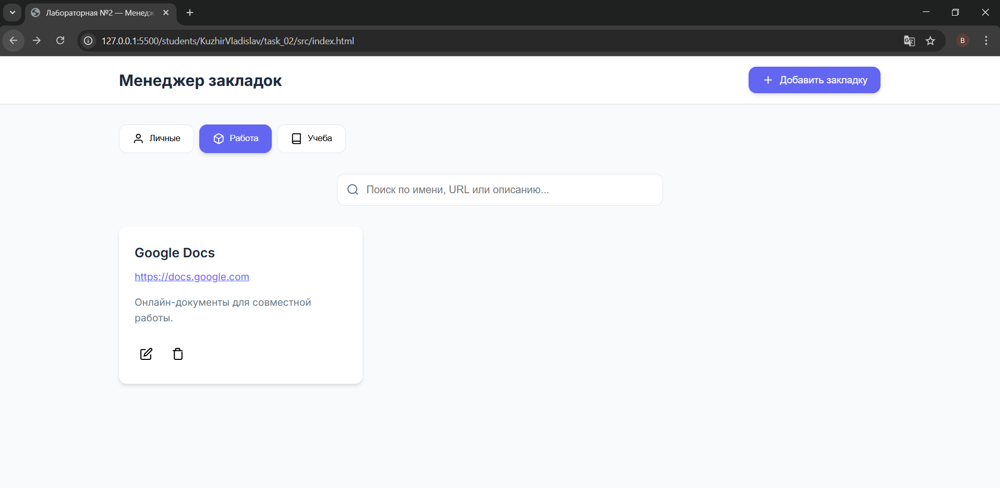

# Министерство образования Республики Беларусь

Учреждение образования

“Брестский Государственный технический университет”

Кафедра ИИТ

      

<strong>Лабораторная работа №2</strong>

<strong>По дисциплине:</strong> “Веб-технологии”

<strong>Тема:</strong> DOM и события: интерактивные компоненты и формы (JavaScript)

      

<strong>Выполнил:</strong>

Студент 4 курса

Группы АС-64

Кужир В.В.

<strong>Проверил:</strong>

Несюк А.Н.

     

<strong>Брест 2025</strong>

---

## Цель работы

Освоить работу с DOM: добавление, удаление и изменение элементов интерфейса.
Научиться обрабатывать события, использовать делегирование, работать с клавиатурной доступностью.
Реализовать дружелюбную клиентскую валидацию форм.

---

### Вариант №36

## Ход выполнения работы

### 1. Структура проекта

- `index.html` — основная страница
- `styles.css` — стилизация и медиазапросы
- `scripts/` — скрипты

### 2. Реализованные элементы

- Интерактивные компоненты:
  Табы, Модальное окно, Поиск по подстроке.
- Форма с валидацией:
  Поля: имя (обяз.), URL (валидный), описание (мин. 20 символов).
- Валидация при вводе и при отправке; пользовательские сообщения об ошибках.
  Кнопка отправки неактивна, если форма невалидна. Отправку предотвращать, выводить результат на странице.
- Делегирование событий:
  Список элементов (карточки/посты): брабоотчик кликов/кнопок «удалить/лайк» повесить на контейнер.
- Доступность:
  Управление с клавиатуры (Tab/Shift+Tab, Enter/Space, Esc).
  ARIA‑атрибуты для аккордеона/модалки/таба (role, aria‑expanded/controls/selected/hidden и т.д.).

### 3. Скриншоты выполненой лабораторной работы

---

## Таблица критериев

👉 Для удобства проверки и выполнения вашей лабораторной работы составьте таблицу критериев опираясь на задание (обычно task_xx/readme.md)

<strong>Пример таблицы критериев: </strong>
_(можно использовать для Лабораторной работы №1)_

| Критерий                                             | Выполнено |
| ---------------------------------------------------- | --------- |
| Семантика/структура и UX‑основы                      | ✅        |
| Адаптивная вёрстка (2+ брейкпоинта)                  | ✅        |
| Доступность (alt/label, фокус, контраст, клавиатура) | ✅        |
| Качество и валидность (Lighthouse ≥ 90, валидаторы)  | ✅        |
| Оформление кода/структура проекта                    | ✅        |
| Публикация и отчёт                                   | ✅        |

### Дополнительные бонусы

| Бонус                                                                 | Выполнено |
| --------------------------------------------------------------------- | --------- |
| Тёмная тема (prefers-color-scheme)                                    | ❌        |
| Сохранение состояния в localStorage (открытые вкладки, лайки и т.п.). | ❌        |
| Юнит‑тесты на чистые функции (например, валидация).                   | ❌        |

---

## Ссылкы

https://glittering-centaur-31ecba.netlify.app/

## Вывод

Освоил работу с DOM: добавление, удаление и изменение элементов интерфейса.
Научился обрабатывать события, использовать делегирование, работать с клавиатурной доступностью.
Реализовал дружелюбную клиентскую валидацию форм.
