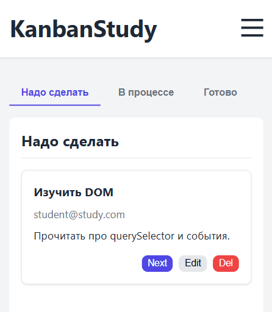
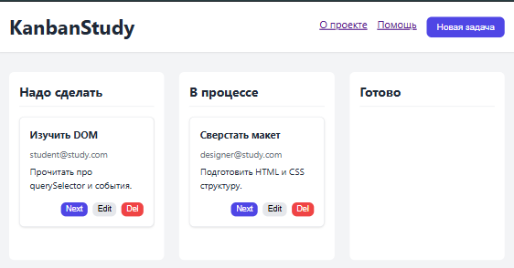
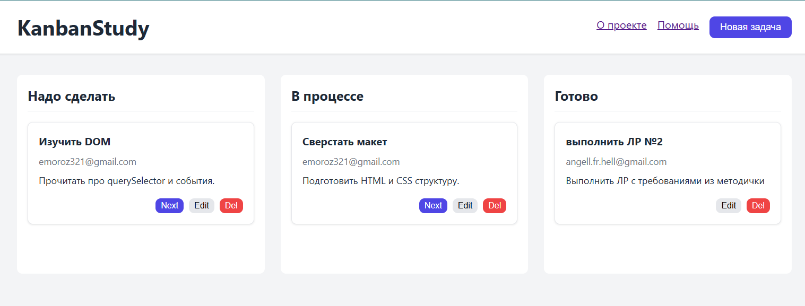
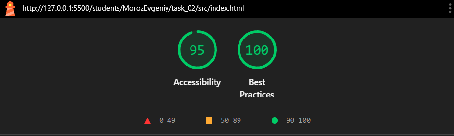
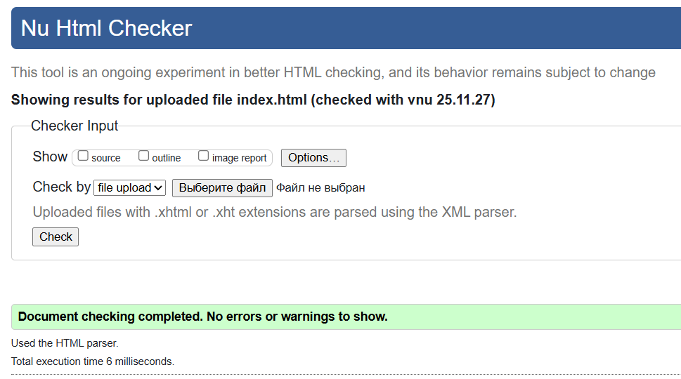
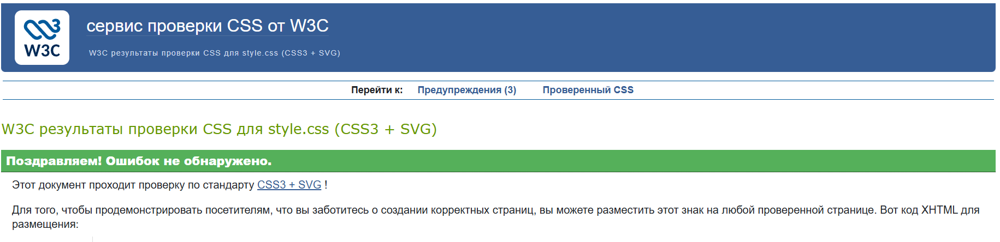

# Министерство образования Республики Беларусь

Учреждение образования

“Брестский Государственный технический университет”

Кафедра ИИТ

      

<strong>Лабораторная работа №2</strong>

<strong>По дисциплине:</strong> “Веб-технологии”

<strong>Тема:</strong> “DOM и события: интерактивные компоненты и формы”

      

<strong>Выполнил:</strong>

Студент 4 курса

Группы АС-63

Мороз Е. В.

<strong>Проверил:</strong>

Несюк А.Н.

     

<strong>Брест 2025</strong>

---

## Цель работы

Освоить работу с DOM: добавление, удаление и изменение элементов интерфейса.
Научиться обрабатывать события, использовать делегирование, обеспечивать доступность с клавиатуры и реализовать клиентскую валидацию форм.

---

### Вариант №15

## Ход выполнения работы

### 1. Структура проекта

- `index.html` — основная страница с семантической разметкой, ARIA-атрибутами и формой в модальном окне
- `styles.css` — стилизация, использование CSS-переменных, адаптивный дизайн (Mobile-first)
- `main.js` — бизнес-логика, управление DOM, валидация и обработка событий на чистом JavaScript (ES6+)

### 2. Интерактивные компоненты (Минимум 3)

* **Универсальное Модальное окно:** Используется для **создания** новых задач и **редактирования** существующих. Реализован **«Фокус-трап»** (Focus Trap), закрытие по `Esc` и возврат фокуса на вызывающий элемент.
* **Адаптивные Табы:** На узких экранах компонент используется для переключения между колонками Kanban ("Надо сделать", "В процессе", "Готово"), что обеспечивает компактный и доступный интерфейс.
* **Бургер-меню:** Реализовано для навигации в шапке на мобильных устройствах.

### 3. Делегирование событий

Обработчик событий установлен на корневой контейнер доски (`#board`). Делегирование используется для управления всеми динамическими элементами (карточками) и их действиями:
* **Удаление** карточки.
* **Перемещение** карточки в следующую колонку.
* **Открытие модалки редактирования**.

### 4. Работа с формой (Валидация)

Форма в модальном окне имеет строгую клиентскую валидацию, выполняемую **в реальном времени** (`oninput`):
* **Название задачи:** Обязательное поле.
* **Email исполнителя:** Проверяется на корректный формат (`user@domain.com`).
* **Описание:** Обязательное поле, минимальная длина — 20 символов.

Кнопка отправки (`Создать / Сохранить`) остается **неактивной** (`disabled`) до тех пор, пока все поля не пройдут валидацию. Отправка формы приводит к обновлению массива данных (`tasks`) и перерисовке DOM (`renderTasks()`), без перезагрузки страницы.

---

## Технические Детали и Доступность (A11y)

Проект разработан с учетом строгих требований к доступности и адаптивности.

### Адаптивность и Стили

* **Mobile-first:** Базовые стили определены для мобильных устройств, а с помощью медиазапросов (от `768px`) происходит переход к десктопной сетке (CSS Grid), где колонки отображаются одновременно.
* **Контрастность:** Контраст текста соответствует уровню WCAG (≥ 4.5:1).

### Клавиатурная Доступность

* **Управление:** Весь интерактивный интерфейс (табы, кнопки, модалка) управляется исключительно с помощью клавиш **`Tab`**, **`Enter`** и **`Esc`**.
* **Фокус:** Реализована видимая подсветка фокуса для всех интерактивных элементов.
* **ARIA-атрибуты:** Использованы необходимые ARIA-атрибуты (`aria-selected`, `aria-expanded`, `role="dialog"`) для корректной работы со скринридерами, что обеспечивает инклюзивность интерфейса.

### 3. Скриншоты работы сайта

Вставьте сюда 3 скриншота:

- Мобильная версия (≤600px):

- Планшетная версия (601–1024px):

- Десктопная версия (>1024px):

---

## Проверка качества

### Lighthouse

Вставьте результаты проверки Lighthouse (Accessibility, Best Practices ≥ 90):

### Валидаторы

Вставьте результаты проверок:

- HTML Validator

- CSS Validator

---

## Таблица критериев

| Критерий                                | Выполнено |
|------------------------------------------|-----------|
| Семантика/структура (landmarks, заголовки) | ✅/ ✅ |
| Адаптивная вёрстка (2+ брейкпоинта, Flex/Grid) | ✅ / ✅ |
| Доступность (alt/label, фокус, контраст, клавиатура) | ✅ / ✅ |
| Качество и валидность (Lighthouse ≥ 90, валидаторы) | ✅ / ✅ |
| Оформление кода/структура проекта        | ✅ / ✅ |
| Публикация и отчёт                       | ✅ / ✅ |

### Дополнительные бонусы

| Бонус                                     | Выполнено |
|-------------------------------------------|-----------|
| Тёмная тема (prefers-color-scheme)        | ❌ / ✅ |
| Адаптивные изображения (picture/srcset)   | ❌ / ✅ |
| Улучшения Web Vitals (CLS/LCP/INP)        | ❌ / ✅ |
| Другие улучшения (указать свои)           | ❌ / ✅ |

---

## Ссылка на публикацию

Вставьте ссылку на GitHub Pages:

## Вывод

В ходе работы была создана адаптивная веб-страница **«Учебная доска Kanban»**, оформленная с применением современных подходов к вёрстке. Были использованы **семантические теги HTML5**, реализована **адаптивность по принципу Mobile-first** с использованием Flexbox и CSS Grid (переход от **Табов** к **Сетке колонок**). Обеспечена **доступность интерфейса (a11y)**: реализовано полное управление с клавиатуры, включая **«фокус-трап»** в модальном окне, и применены необходимые ARIA-атрибуты для всех интерактивных компонентов. В процессе освоены навыки **делегирования событий** для управления карточками (удаление/перемещение), **клиентской валидации** формы, создания универсального **модального окна редактирования** и работы с переменными CSS, что позволило успешно решить задачу по созданию функционального и доступного интерфейса.
