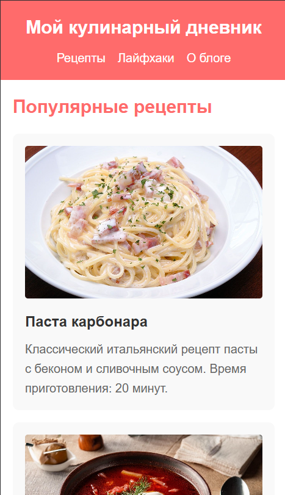
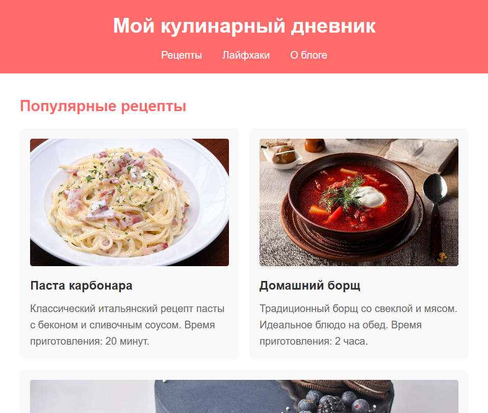
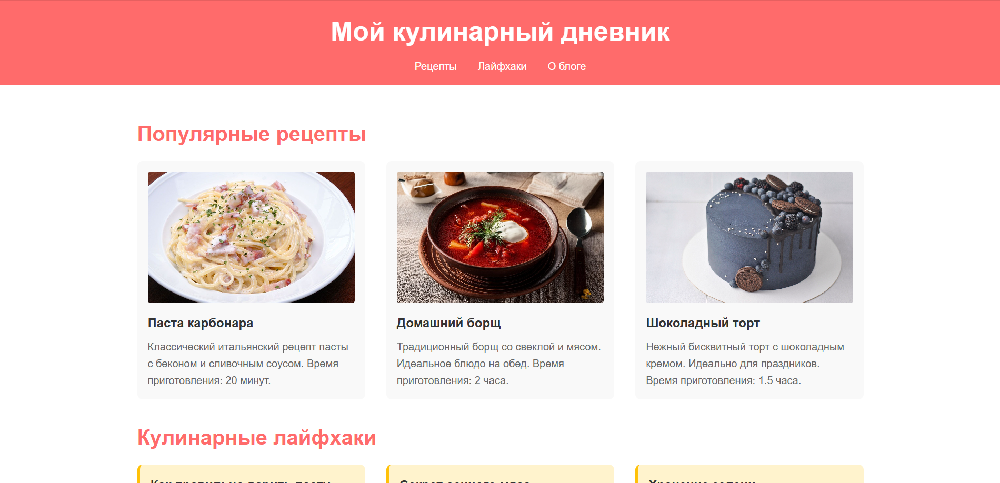
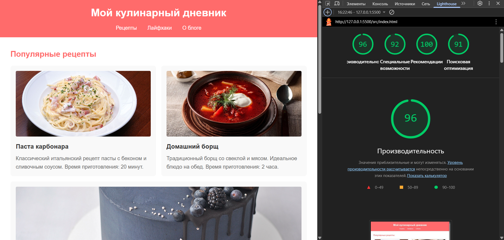

# Лабораторная работа №1: HTML/CSS: семантика, адаптивность и доступность

<p align="center">Министерство образования Республики Беларусь</p>
<p align="center">Учреждение образования</p>
<p align="center">"Брестский Государственный технический университет"</p>
<p align="center">Кафедра ИИТ</p>
<br><br><br><br><br><br>
<p align="center"><strong>Лабораторная работа №1</strong></p>
<p align="center"><strong>По дисциплине:</strong> "Веб-технологии"</p>
<p align="center"><strong>Тема:</strong> "HTML/CSS: семантика, адаптивность и доступность"</p>
<br><br><br><br><br><br>
<p align="right"><strong>Выполнил:</strong></p>
<p align="right">Студент 4 курса</p>
<p align="right">Группы АС-64</p>
<p align="right">Попов А.С.</p>
<p align="right"><strong>Проверил:</strong></p>
<p align="right">Несюк А.Н.</p>
<br><br><br><br><br>
<p align="center"><strong>Брест 2025</strong></p>

---

## Цель работы

Освоить основы семантической вёрстки HTML5, реализовать адаптивную структуру веб-страницы по принципу **mobile-first** и обеспечить её доступность в соответствии с современными стандартами.

---

### Вариант №38

**Тема:** Веб-страница «Мой кулинарный дневник» — рецепты, лайфхаки, фото.

## Ход выполнения работы

### 1. Структура проекта

```text
task_01/
├── doc/
│   ├── README.md
│   └── screenshots/
├── src/
│   ├── index.html
│   ├── styles.css
│   └── img/
```

- `index.html` — основная страница с кулинарным контентом
- `styles.css` — стилизация и медиазапросы  
- `img/` — изображения рецептов

### 2. Реализованные элементы

- **Семантическая разметка HTML5:** использованы теги `<header>`, `<nav>`, `<main>`, `<section>`, `<article>`, `<footer>`
- **Flexbox и CSS Grid:** применены для адаптивной раскладки карточек рецептов и лайфхаков
- **Mobile-first подход:** базовые стили для мобильных устройств с расширением через медиазапросы
- **2 брейкпоинта:**
  - 601px — планшетная версия
  - 1025px — десктопная версия
- **Атрибут `alt`** для изображений

### 3. Скриншоты работы сайта

- Мобильная версия (≤600px):  
  

- Планшетная версия (601–1024px):  
  

- Десктопная версия (>1024px):  
  

---

## Проверка качества

### Lighthouse



### Валидаторы

- _HTML Validator_ без ошибок!
- _CSS Validator_ без ошибок!

---

## Таблица критериев

| Критерий                                | Выполнено |
|------------------------------------------|-----------|
| Семантика/структура (landmarks, заголовки) | ✅ |
| Адаптивная вёрстка (2+ брейкпоинта, Flex/Grid) | ✅ |
| Доступность (alt/label, фокус, контраст, клавиатура) | ❌ |
| Качество и валидность (Lighthouse ≥ 90, валидаторы) | ✅ |
| Оформление кода/структура проекта        | ✅ |
| Публикация и отчёт                       | ✅ |

### Дополнительные бонусы

| Бонус                                     | Выполнено |
|-------------------------------------------|-----------|
| Тёмная тема (prefers-color-scheme)        | ❌ |
| Адаптивные изображения (picture/srcset)   | ❌ |
| Улучшения Web Vitals (CLS/LCP/INP)        | ❌ |

---

## Ссылка на публикацию

<https://lexusxdsd.github.io/WT-AC-2025/task_01/>

## Вывод

В ходе работы была создана адаптивная веб-страница "Мой кулинарный дневник" с использованием семантических тегов HTML5. Реализована мобильно-ориентированная вёрстка с двумя брейкпоинтами для планшетов и десктопов. Применены технологии Flexbox и CSS Grid для гибкой раскладки контента. Страница прошла валидацию HTML и CSS.
