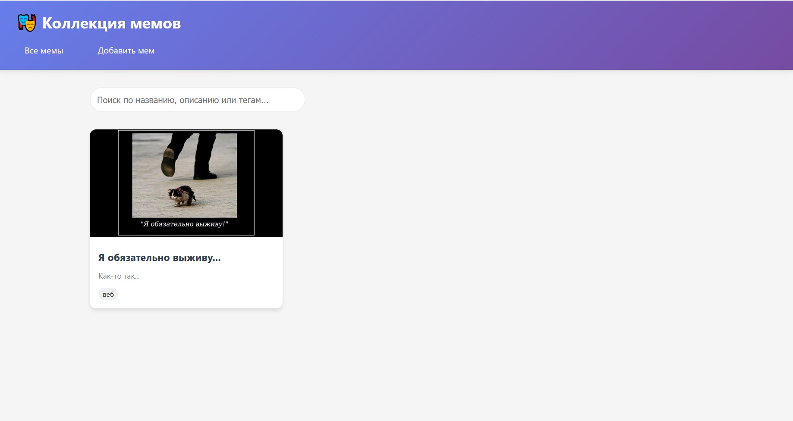
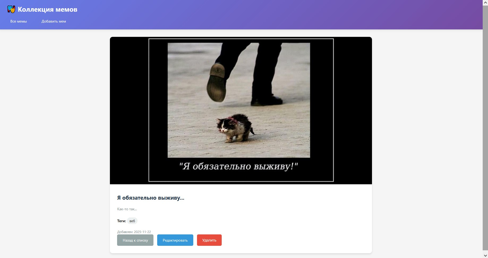
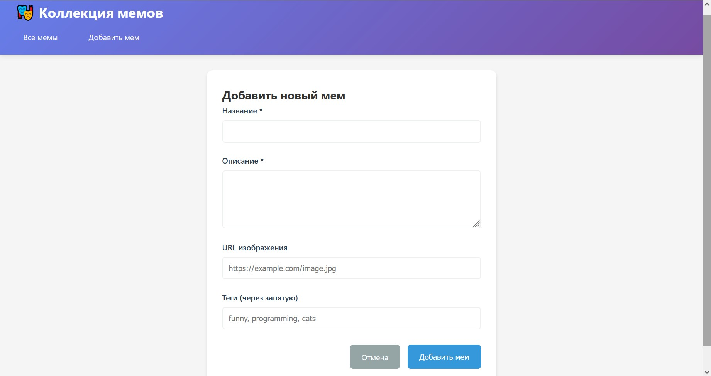

# Лабораторная работа 04. REST-клиент SPA

## Описание проекта

Одностраничное приложение (SPA) для управления коллекцией мемов с использованием чистого JavaScript. Приложение реализует hash-маршрутизацию, CRUD-операции и различные состояния интерфейса.

## Маршруты

* #/items - Список всех мемов
* #/items/:id - Детальная информация о меме
* #/new - Создание нового мема
* #/items/:id/edit - Редактирование мема

## CRUD операции

* Create - Добавление нового мема
* Read - Просмотр списка и детальной информации
* Update - Редактирование существующего мема
* Delete - Удаление мема с подтверждением

## Состояния интерфейса

* Loading - Состояние загрузки
* Error - Обработка ошибок
* Empty - Пустые состояния
* Success - Уведомления об успешных операциях

## Архитектура

* Модульная структура - разделение на router, api, views
* Hash-маршрутизация - нативный роутер без фреймворков
* REST API - работа с мок-сервером

## UX улучшения

* Блокировка форм во время отправки
* Подтверждение удаления
* Валидация обязательных полей
* Автосохранение параметров поиска в URL
* Debounce поиска (500ms)

## Структура проекта

```text
spa-app/
├── index.html
├── css/
│   └── style.css
├── js/
│   ├── app.js          # Точка входа
│   ├── router.js       # Маршрутизатор
│   ├── api.js          # REST API клиент
│   └── views/
│       └── utils.js    # Представления и утилиты
└── README.md
```

## Запуск приложения

### Способ 1: Live Server

* Установите расширение Live Server для VS Code
* Откройте index.html в VS Code
* Нажмите "Go Live" в статус-баре

### Способ 2: Локальный сервер

**Python 3**
python -m http.server 8000

**Python 2**
python -m SimpleHTTPServer 8000

**Node.js (предварительно установите http-server)**
npx http-server

### Способ 3: Прямое открытие

* Откройте index.html непосредственно в браузере (некоторые функции могут не работать из-за CORS)

## API

### Mock API эндпоинты

* GET /items - Получить список мемов
* GET /items/:id - Получить мем по ID
* POST /items - Создать новый мем
* PATCH /items/:id - Обновить мем
* DELETE /items/:id - Удалить мем

### Структура данных мема

```js
{
  id: number,
  title: string,
  description: string,
  image: string,
  tags: string[],
  createdAt: string
}
```

## Использование

### Просмотр мемов

* Перейдите на главную страницу (#/items)
* Используйте поиск для фильтрации
* Нажмите на карточку мема для просмотра деталей

### Добавление мема

* Нажмите "Добавить мем" в навигации
* Заполните обязательные поля (название, описание)
* Укажите URL изображения и теги (опционально)
* Нажмите "Добавить мем"

### Редактирование мема

* Перейдите на страницу деталей мема
* Нажмите "Редактировать"
* Внесите изменения
* Сохраните изменения

### Удаление мема

* На странице деталей мема нажмите "Удалить"
* Подтвердите действие
* Мем будет удален из коллекции

## Скриншоты

**Главная страница со списком мемов**


**Детальная страница мема**


**Форма создания мема**


## Технические детали

### Маршрутизатор

* Обработка событий hashchange и load
* Извлечение параметров из URL
* Поддержка query-параметров
* Обработка 404 ошибок

### API модуль

* Имитация задержки сети (500ms)
* Валидация данных
* Локальное хранение в памяти
* Обработка ошибок

## Ссылка на проект

[Ссылка](https://kulibini.github.io/Lab4/)
