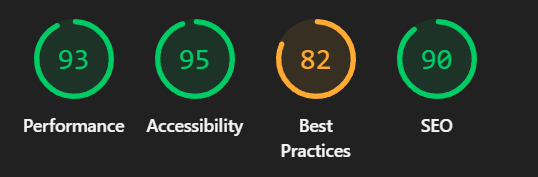
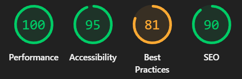
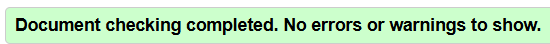

# Архитектура вёрстки

## Общий подход

- Mobile First: вёрстка реализована по принципу "сначала мобильные устройства" с последующим усложнением для планшетов и десктопов
- CSS Grid + Flexbox: комбинированное использование современных технологий раскладки
- Адаптивный дизайн: плавное изменение интерфейса для разных размеров экранов

## Ключевые структурные элементы

### Flexbox контейнеры

- Header: `.header-content` - выравнивание логотипа и слогана
- Навигация: `nav ul` - горизонтальное меню
- Карточки книг: `.book-content` - вертикальное расположение контента
- Рейтинг: `.book-rating` - выравнивание звёзд и цифровой оценки
- Социальные ссылки: `.social-links` - равномерное распределение
- Основной макет: `body` - колоночная организация для sticky footer

### CSS Grid области

- Сетка книг: `.books-grid` - адаптивная сетка карточек
- Отзывчивые колонки:
  - Мобильные: 1 колонка
  - Планшеты: 2 колонки
  - Десктоп: 3 колонки

## Медиазапросы

### Мобильные устройства (≤600px)

```css
@media (width <= 600px) {
}
```

- Вертикальная навигация
- Одноколоночная сетка книг
- Уменьшенные отступы
- Адаптивные размеры шрифтов

### Планшеты (601–1024px)

```css
@media (width >= 601px) and (width <= 1024px) {
}
```

- Двухколоночная сетка книг
- Промежуточные отступы

### Десктопы (>1024px)

```css
@media (width >= 1025px) {
}
```

- Трёхколоночная сетка книг
- Максимальная ширина контента 1200px

## Особенности доступности

- Skip-link: скрытая ссылка для перехода к основному контенту
- Семантические теги: правильная HTML5 разметка
- Контрастность: поддержка `prefers-contrast: high`
- Плавная прокрутка: `scroll-behavior: smooth`
- Фокус-индикаторы: визуальное выделение активных элементов

## CSS Переменные

Используется система CSS-переменных для единообразного управления:

- Цветовая схема
- Размеры скруглений
- Тени и переходы
- Типографика

## Lighthouse

### Mobile



### Desktop



## Валидаторы HTML/CSS

### HTML



### CSS


## Ссылка на проект

[Site](https://stis25.github.io/Web_Task01/)
