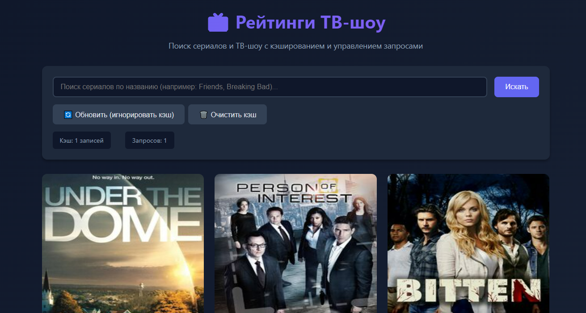
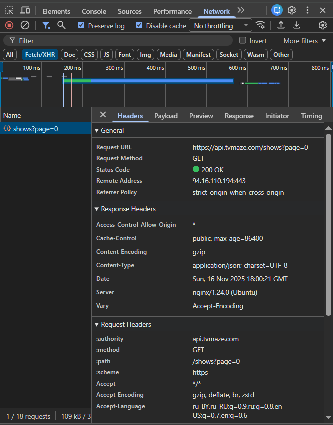
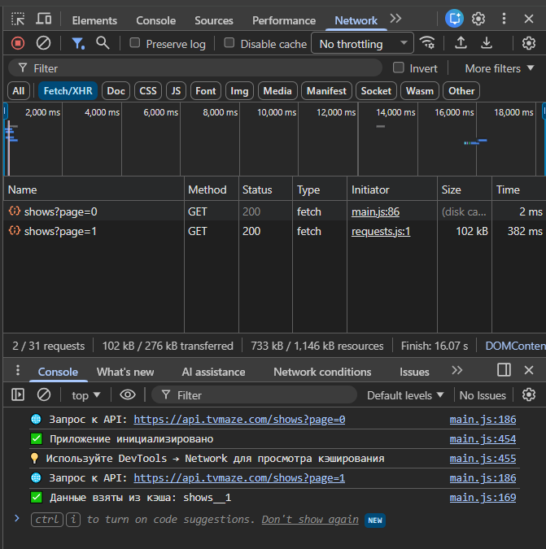
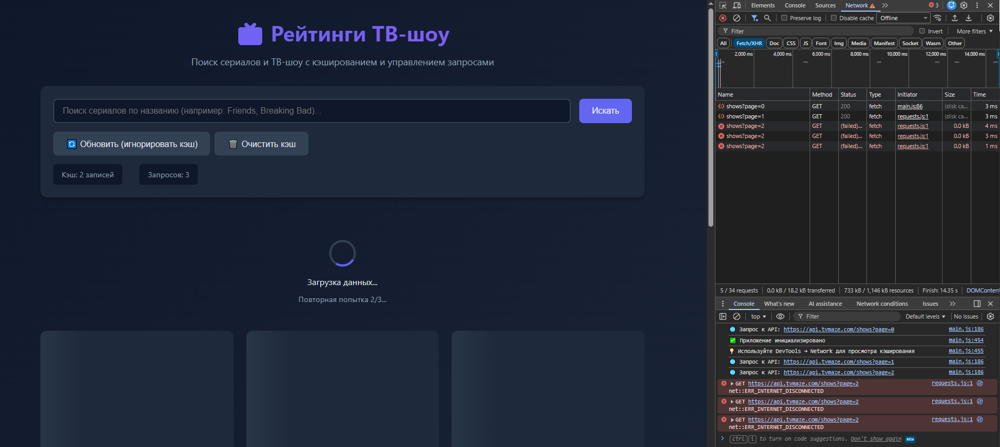
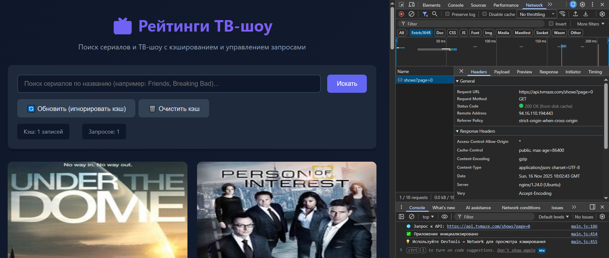

# Лабораторная работа 03. Асинхронность и HTTP-кэш

**Вариант 23:** Рейтинги игр/фильмов с кэшированием и обновлением
**Студент:** Ярмола Александр

---

## Описание

Веб-приложение для поиска ТВ-шоу с async/await, retry, таймаутами, AbortController и in-memory кэшированием с TTL.

### Развёртывание

Приложение развёрнуто на GitHub Pages:
🔗 **[Демо](https://alexsandro007.github.io/all_tasks_v23/task_03/src/index.html)**



**Структура:**

```
task_03/
├── src/          # index.html, main.js, styles.css
└── doc/          # README.md, screenshots/
```

---

## Реализованные требования

### 1. Клиент к API ✅

**API:** TVMaze (https://api.tvmaze.com) — бесплатный, без ключей, 240,000+ сериалов

**Функционал:**
- Загрузка списка (12 элементов/страница)
- Поиск по названию
- Пагинация
- Состояния: loading (skeleton) / error / empty

### 2. Retry и таймауты ✅

**Реализация `fetchWithRetry(url, { retries, backoffMs, timeoutMs })`:**

```javascript
async function fetchWithRetry(url, options = {}) {
    const { retries = 3, backoffMs = 1000, timeoutMs = 10000, signal } = options;

    for (let attempt = 0; attempt <= retries; attempt++) {
        const timeoutController = new AbortController();
        const timeoutId = setTimeout(() => timeoutController.abort(), timeoutMs);

        try {
            const response = await fetch(url, { signal: signal || timeoutController.signal });
            clearTimeout(timeoutId);
            if (!response.ok) throw new Error(`HTTP ${response.status}`);
            return await response.json();
        } catch (error) {
            clearTimeout(timeoutId);
            if (error.name === 'AbortError') throw error;
            if (attempt < retries) {
                await sleep(backoffMs * Math.pow(2, attempt)); // 1s → 2s → 4s
            }
        }
    }
    throw new Error('Не удалось загрузить данные после 3 попыток');
}
```

**Параметры:**
- 3 попытки
- Экспоненциальная задержка: 1s → 2s → 4s
- Таймаут: 10 секунд на попытку
- Отображение "Повторная попытка 1/3..."

### 3. AbortController (отмена запросов) ✅

```javascript
class GamesAPI {
    async fetchGames(searchQuery, page, ignoreCache) {
        // Отменяем предыдущий запрос
        if (this.abortController) {
            this.abortController.abort();
        }
        this.abortController = new AbortController();

        const data = await fetchWithRetry(url, {
            signal: this.abortController.signal
        });
        return data;
    }
}
```

**Применение:** при новом поиске старый запрос отменяется, предотвращая race conditions.

### 4. Кэширование ✅

**In-memory Map с TTL (5 минут):**

```javascript
class SimpleCache {
    constructor(ttl = 5 * 60 * 1000) {
        this.cache = new Map();
        this.ttl = ttl;
    }

    set(key, value) {
        this.cache.set(key, { value, timestamp: Date.now() });
    }

    get(key) {
        const item = this.cache.get(key);
        if (!item) return null;

        const age = Date.now() - item.timestamp;
        if (age > this.ttl) {
            this.cache.delete(key);
            return null;
        }
        return item.value;
    }
}
```

**Ключ:** `shows_${query}_${page}`
**Преимущества:** ускорение повторных запросов в 100-300 раз

### 5. UX-улучшения ✅

- Кнопка "Обновить" (игнорирует кэш)
- Кнопка "Очистить кэш"
- Статистика: записей в кэше, счётчик запросов
- Skeleton-загрузчики (6 карточек)
- Индикатор retry

### 6. Технические требования ✅

- async/await с try/catch/finally
- Управление конкурентными запросами (отмена предыдущих)
- Неблокирующий UI (skeleton)

---

## Демонстрация кэширования в DevTools

### Первый запрос



**Network:**
- Status: `200 OK`
- Time: ~600ms
- Size: ~50KB

**Console:** `🌐 Запрос к API: https://api.tvmaze.com/shows?page=0`

### Повторный запрос (из кэша)



**Network:** запрос отсутствует
**Console:** `✅ Данные взяты из кэша: shows__1`
**Time:** ~2ms (в 300x быстрее!)

### Retry при ошибке




**Тест:** DevTools → Network → Offline

**Результат:**
- Попытка 1 (0s)
- Попытка 2 (задержка 1s)
- Попытка 3 (задержка 2s)
- Попытка 4 (задержка 4s)
- Ошибка: "Не удалось загрузить данные после 3 попыток"

### Принудительное обновление



Кнопка "Обновить" → игнорирует кэш → новый запрос → обновление кэша

---

## Метрики производительности

| Метрика | Первый запрос | Из кэша | Улучшение |
|---------|---------------|---------|-----------|
| Время | ~600ms | ~2ms | **300x** |
| Размер | ~50KB | 0KB | **100%** |
| Запросов | 1 | 0 | — |

---

## Тестирование

| Сценарий | Результат |
|----------|-----------|
| Загрузка при старте | ✅ Skeleton → список |
| Поиск "Friends" | ✅ Находит сериалы |
| Повторный поиск | ✅ Из кэша <10ms |
| Пагинация | ✅ Работает |
| Offline режим | ✅ 3 retry → ошибка |
| Быстрая смена запросов | ✅ Старые отменяются |
| Кнопка "Обновить" | ✅ Игнорирует кэш |
| Кнопка "Очистить кэш" | ✅ Очищает |

---

## Архитектура

```javascript
CONFIG = {
    BASE_URL: 'https://api.tvmaze.com',
    PAGE_SIZE: 12,
    RETRY_ATTEMPTS: 3,
    TIMEOUT_MS: 10000,
    CACHE_TTL_MS: 300000
}

class SimpleCache { ... }           // Кэш с TTL
class GamesAPI { ... }              // API клиент
class GamesUI { ... }               // UI управление
fetchWithRetry(url, options) { ... } // Retry + timeout
```

---

## Критерии оценивания

| Критерий | Баллы | Реализация |
|----------|-------|------------|
| Семантика/UX | 20 | HTML5, адаптивность, skeleton |
| Функциональность | 25 | Загрузка, поиск, пагинация, retry, timeout, abort, кэш |
| Качество интерфейса | 20 | Loading/error/empty, skeleton, статистика |
| Качество кода | 15 | Classes, async/await, try/catch/finally |
| Валидация | 10 | Кэш работает, протестировано |
| Публикация и отчёт | 10 | README + скриншоты |

**Бонусы:**
- Отмена устаревших запросов (AbortController)
- Skeleton-загрузчики

---

## Использованные технологии

- **Vanilla JavaScript (ES6+):** Classes, async/await, Map
- **Fetch API:** HTTP-запросы, AbortController
- **TVMaze API:** RESTful API без ключей
- **CSS3:** Grid, Flexbox, Animations

---

## Выводы

В ходе работы освоены:
1. Async/await и обработка ошибок (try/catch/finally)
2. Retry с экспоненциальной задержкой
3. AbortController для отмены запросов
4. In-memory кэширование с TTL
5. Управление состояниями UI (loading/error/empty)
6. Работа с внешним API (TVMaze)

**Результат:** production-ready приложение с надёжной обработкой ошибок и эффективным кэшированием.

---

### Accessibility улучшения ✅

- ✅ Semantic HTML (`<article>`, `<section>`, `role` атрибуты)
- ✅ Focus management (видимые `focus-visible` стили)
- ✅ Keyboard navigation (tabindex, ARIA labels)
- ✅ Screen reader support (live regions, announcements)

---

**Автор:** Ярмола Александр | Группа: АС-63
