# Министерство образования Республики Беларусь

<p align="center">Учреждение образования</p>
<p align="center">"Брестский Государственный технический университет"</p>
<p align="center">Кафедра ИИТ</p>
<br><br><br><br><br><br>
<p align="center"><strong>Лабораторная работа №7</strong></p>
<p align="center"><strong>По дисциплине:</strong> "Веб-технологии"</p>
<p align="center"><strong>Тема:</strong> "React‑приложение: маршрутизация, состояние, формы, работа с API"</p>
<br><br><br><br><br><br>
<p align="right"><strong>Выполнил:</strong></p>
<p align="right">Студент 4 курса</p>
<p align="right">Группы АС-63</p>
<p align="right">Ярмоловис А.С.</p>
<p align="right"><strong>Проверил:</strong></p>
<p align="right">Несюк А.Н.</p>
<br><br><br><br><br>
<p align="center"><strong>Брест 2025</strong></p>

---

## Цель работы

* Создать полноценный SPA на React.
* Подключить маршрутизацию, реализовать формы и взаимодействие с API.

---

### Вариант №24

## Ход выполнения работы

### 1. Структура проекта

- `src/`
- `components/`
- `common/`
- `EmptyState.jsx` — компонент для отображения пустого состояния
- `ErrorMessage.css` — стили для компонента ошибки
- `ErrorMessage.jsx` — компонент для отображения сообщений об ошибках
- `Header.css` — стили для шапки приложения
- `Header.jsx` — компонент шапки с навигацией
- `Loading.css` — стили для индикатора загрузки
- `Loading.jsx` — компонент индикатора загрузки
- `Notification.css` — стили для уведомлений
- `Notification.jsx` — компонент для отображения уведомлений
- `ProtectedRoute.jsx` — защищенный маршрут для аутентификации
- `forms/`
- `FormInput.css` — стили для поля ввода формы
- `FormInput.jsx` — компонент поля ввода для форм
- `GameForm.css` — стили для формы игры
- `GameForm.jsx` — компонент формы создания/редактирования игры
- `features/`
- `auth/`
- `authSlice.js` — Redux slice для управления состоянием аутентификации
- `Login.jsx` — компонент страницы входа
- `games/`
- `GameCard.css` — стили для карточки игры
- `GameCard.jsx` — компонент карточки игры в списке
- `GameDetail.jsx` — компонент страницы деталей игры
- `GamesList.css` — стили для списка игр
- `GamesList.jsx` — компонент списка игр
- `gamesSlice.js` — Redux slice для управления состоянием игр
- `hooks/`
- `useAuth.js` — кастомный хук для работы с аутентификацией
- `pages/`
- `AddGame.jsx` — страница добавления новой игры
- `EditGame.jsx` — страница редактирования игры
- `FormPage.css` — стили для страницы формы
- `GameDetailPage.css` — стили для страницы деталей игры
- `GameDetailPage.jsx` — страница деталей игры
- `Games.css` — стили для страницы игр
- `Games.jsx` — страница списка игр
- `GamesLayout.jsx` — лейаут для страниц игр
- `Home.css` — стили для главной страницы
- `Home.jsx` — главная страница
- `Login.css` — стили для страницы входа
- `Login.jsx` — страница входа в систему
- `NotFound.css` — стили для страницы 404
- `NotFound.jsx` — страница 404 ошибки
- `services/`
- `api.js` — модуль для API запросов
- `apiSlice.js` — Redux slice для API
- `mockData.js` — моковые данные для разработки
- `store/`
- `index.js` — конфигурация Redux store
- `utils/`
- `validation.js` — утилиты для валидации данных
- `App.css` — основные стили приложения
- `App.jsx` — корневой компонент приложения
- `index.css` — глобальные стили
- `main.jsx` — точка входа React приложения
- `.env` — переменные окружения
- `.gitignore` — исключения для Git
- `index.html` — HTML шаблон
- `package.json` — конфигурация npm-проекта и зависимости
- `README.md` — инструкция по запуску и документация
- `vite.config.js` — конфигурация Vite

---

### 2. Запуск проекта

#### 2.1 Установка зависимостей

* Откройте проект в VSCode.
* Установите зависимости:

```bash
npm install
```

#### 2.2 Запуск сервера

* Запустить сервер в режиме разработки:

```bash
npm run dev
```

* Сервер запустится по адресу:

```bash
http://localhost:3000
```

При первом запуске API будет доступно по корневому пути.

---

### 3. Скриншоты работы сайта

- Главная:
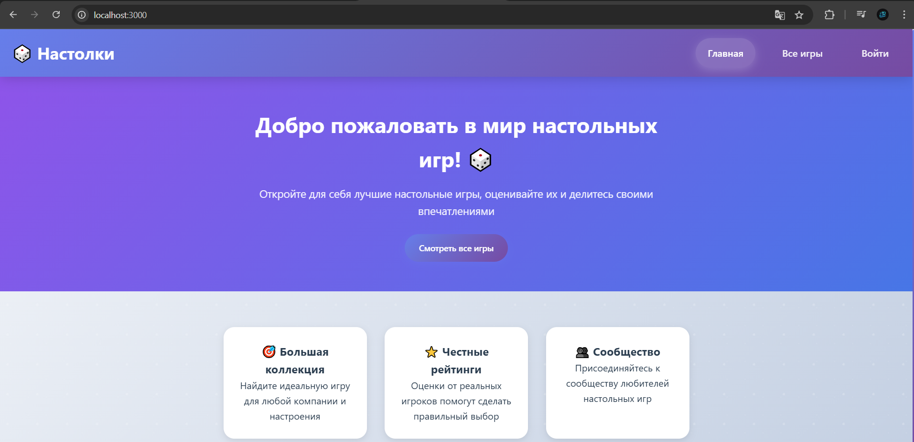

- Список игр:
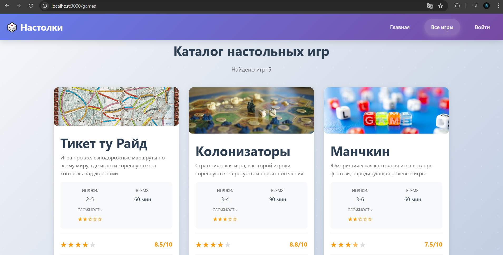

- Детали игры:
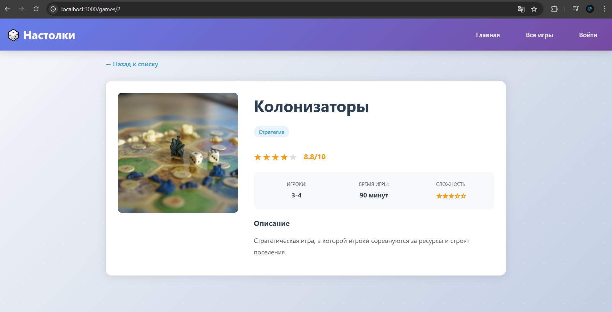

- Добавление игры:
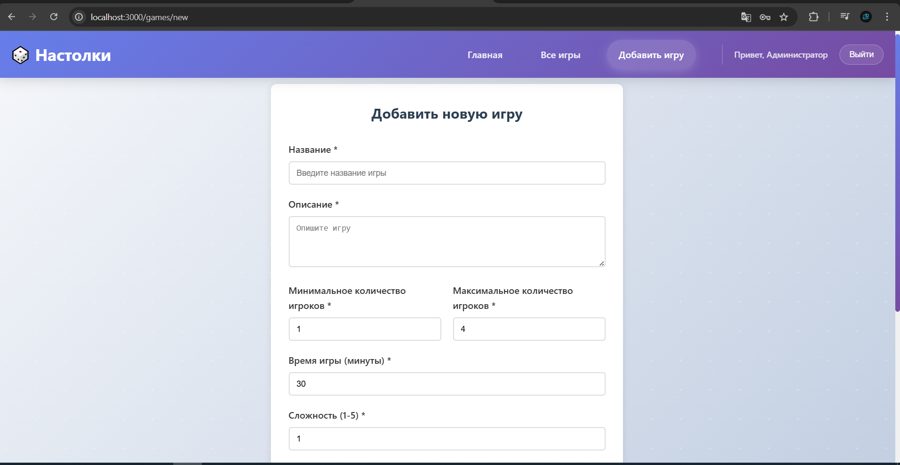

- Редактирование игры:
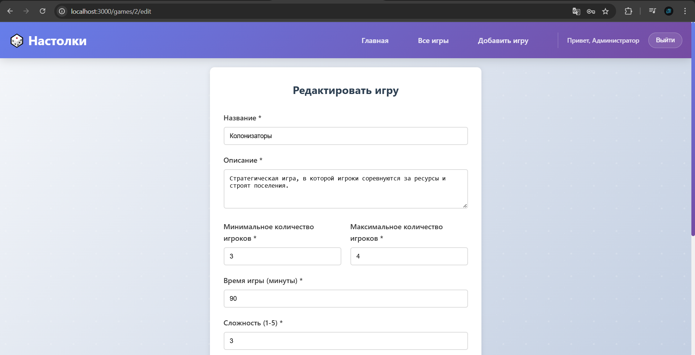

-Логин:
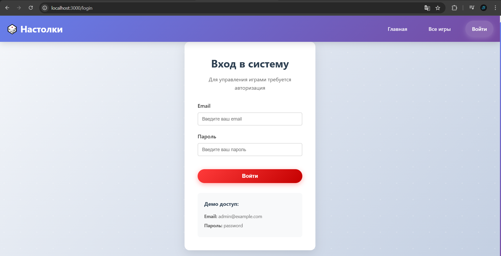

-NotFound:
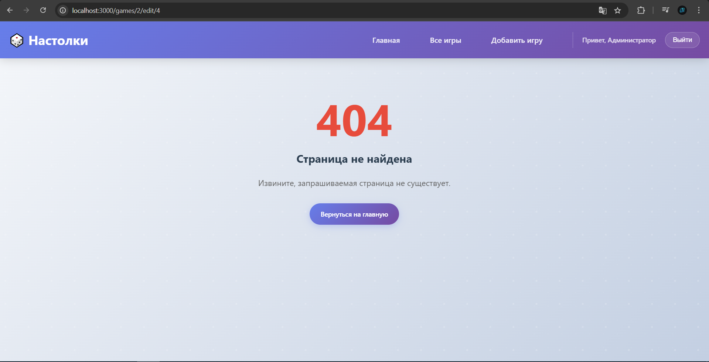

-Загрузка:
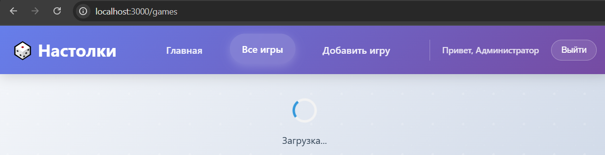

-Ошибка:
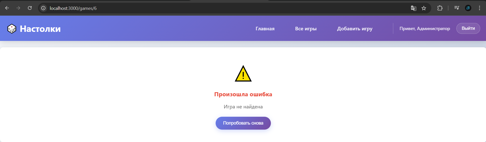

-Пустота:
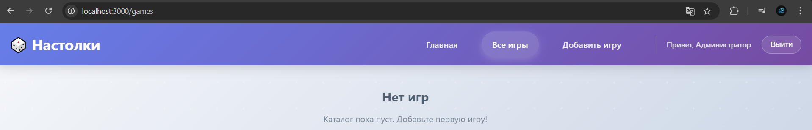

-При обращении http://localhost:3000/games/new(редирект):
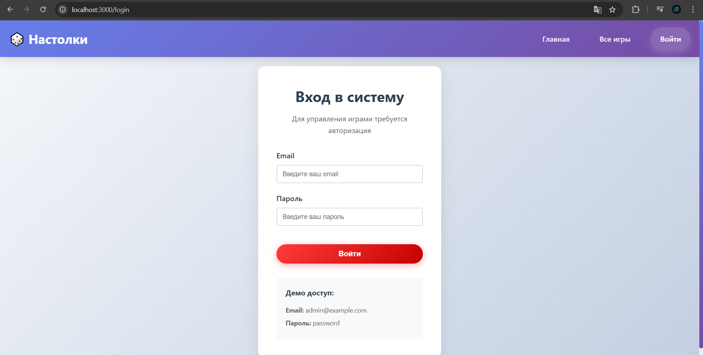

---

## Таблица критериев

| Критерий                                                                | Баллы |  Выполнено |
|-------------------------------------------------------------------------|-------|------------|
| Структура и UX                                                          |  20   |  ✅ / ✅  |
| Функциональность (маршрутизация + CRUD)                                 |  25   |  ✅ / ✅  |
| Качество интерфейса                                                     |  20   |  ✅ / ✅  |
| Качество кода / архитектуры                                             |  15   |  ✅ / ✅  |
| Тесты (1–2 unit/RTL)                                                    |  10   |  ✅ / ✅  |
| Документация/инструкция                                                 |  10   |  ✅ / ✅  |

### Дополнительные бонусы

| Бонус                                                                | Баллы | Выполнено |
| -------------------------------------------------------------------- | ----- | --------- |
| Оптимистичные обновления, отмена запросов, предзагрузка.             | 10    | ❌ / ✅  |
| Ленивые маршруты (code splitting).                                   | 10    | ❌ / ✅  |
| Dark mode и сохранение предпочтений.                                 | 10    | ❌ / ✅  |

---

## Ссылка на публикацию

👉 Вставьте ссылку на GitHub Pages: https://yarmolov.github.io/WT-LAB7/

## Вывод

Создали полноценное одностраничное приложение (SPA) на React, где реализована маршрутизация с помощью React Router, включая защищённые маршруты для страниц, доступных только авторизованным пользователям. Приложение умеет отображать разные страницы: главную, каталог игр, детали игры, формы добавления и редактирования, страницу входа и страницу 404. Формы работают с состояниями ввода и валидацией, а взаимодействие с API реализовано через RTK Query с моковыми данными, поддерживается загрузка, ошибки, пустые состояния и обновление данных. Компоненты разделены по фичам и общие переиспользуемые элементы вынесены в отдельную папку, что делает код структурированным и удобным для расширения. Все состояния интерфейса можно демонстрировать для тестирования и скриншотов, а пользовательский интерфейс обновляется динамически без перезагрузки страницы.
