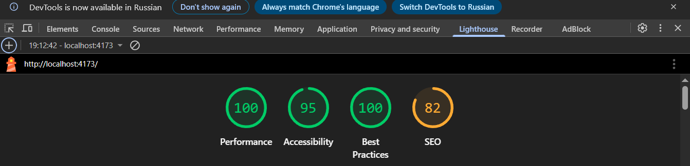
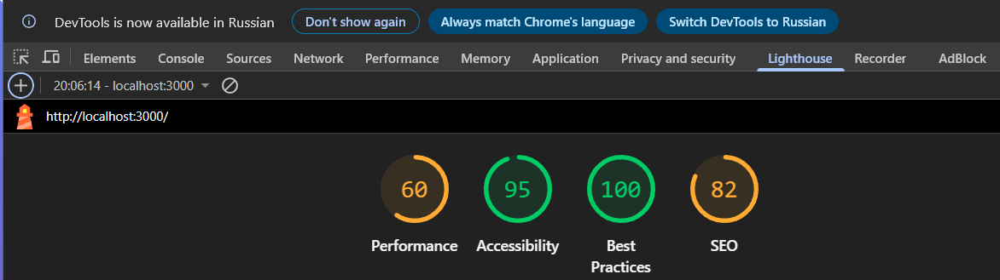

# Министерство образования Республики Беларусь

<p align="center">Учреждение образования</p>
<p align="center">"Брестский Государственный технический университет"</p>
<p align="center">Кафедра ИИТ</p>
<br><br><br><br><br><br>
<p align="center"><strong>Лабораторная работа №8</strong></p>
<p align="center"><strong>По дисциплине:</strong> "Веб-технологии"</p>
<p align="center"><strong>Тема:</strong> "Качество и деплой: тесты, Docker, CI/CD, Lighthouse"</p>
<br><br><br><br><br><br>
<p align="right"><strong>Выполнил:</strong></p>
<p align="right">Студент 4 курса</p>
<p align="right">Группы АС-63</p>
<p align="right">Ярмоловис А.С.</p>
<p align="right"><strong>Проверил:</strong></p>
<p align="right">Несюк А.Н.</p>
<br><br><br><br><br>
<p align="center"><strong>Брест 2025</strong></p>

---

## Цель работы

* Настроить unit/integration/e2e тесты (по мере необходимости).
* Подготовить Dockerfile и docker‑compose для локального запуска.
* Собрать базовый pipeline в GitHub Actions.

---

### Вариант №24

## Ход выполнения работы

### 1. Запуск проекта

#### 1.1 Установка зависимостей

* Установите зависимости:

```bash
npm install
```

#### 1.2 Запуск сервера

* Запустить сервер в режиме разработки:

```bash
npm run dev
```

* Сервер запустится по адресу:

```bash
http://localhost:3000
```

При первом запуске API будет доступно по корневому пути.

---

### 2 Тестирование

#### 2.1 Запуск всех тестов

```bash
npm test
```

#### 2.2 Запуск линтера

```bash
npm run lint
```

---

### 3 Production сборка

* Сборка проекта

```bash
npm run lint
```

* Просмотр production версии

```bash
npm run preview
```

* Приложение доступно: http://localhost:4173

---

### 3 Docker

* Сборка и запуск в Docker

```bash
docker-compose up --build
```

* Приложение доступно: http://localhost:3000
* Остановка контейнеров

```bash
docker-compose down
```

---

### 4. Скриншоты Lighthouse

* При npm run preview (production сборка):

- Lighthouse_prod:


* При npm run dev (development режим)

- Lighthouse_dev:


---

## Таблица критериев

| Критерий                                                                | Баллы |  Выполнено |
|-------------------------------------------------------------------------|-------|------------|
| Тесты                                                                   |  20   |  ✅ / ✅  |
| Контейнеризация                                                         |  20   |  ✅ / ✅  |
| CI (сборка / тесты) — 20                                                |  20   |  ✅ / ✅  |
| Качество интерфейса/показатели Lighthouse                               |  20   |  ✅ / ✅  |
|Качество кода / конфигураций                                             |  10   |  ✅ / ✅  |
| Документация / инструкция                                               |  10   |  ✅ / ✅  |

### Дополнительные бонусы

| Бонус                                                                | Баллы | Выполнено |
| -------------------------------------------------------------------- | ----- | --------- |
| Оптимистичные обновления, отмена запросов, предзагрузка.             | 10    | ❌ / ✅  |
| Ленивые маршруты (code splitting).                                   | 10    | ❌ / ✅  |
| Dark mode и сохранение предпочтений.                                 | 10    | ❌ / ✅  |

---

## Ссылка на публикацию

👉 Вставьте ссылку на GitHub Pages: https://yarmolov.github.io/WT-LAB8/

## Вывод

Созданы и настроены unit и integration тесты - 4 теста проходят успешно. Реализован многостадийный Dockerfile с docker-compose для локального запуска. Настроен базовый CI/CD пайплайн в GitHub Actions с этапами установки зависимостей, линтинга, тестирования и сборки. Все конфигурационные файлы готовы и рабочие.
